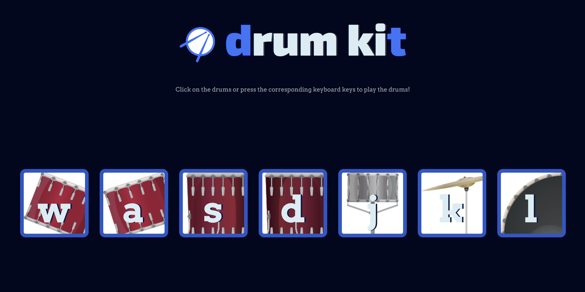

# drum-kit

Feeling funny at work and don't have a drum roll for your awesome one-liner joke about your boss, that will probably get you fired? Look no further, Drum Kit to the rescue! (Lawsuit expenses not included in package).  

  

---  

This is an exercise app while following the "[The Complete 2019 Web Development Bootcamp](https://www.udemy.com/the-complete-web-development-bootcamp/)" Udemy course. It demonstrates using JavaScript to add event listeners to buttons and the keyboard, and play different sounds when the events are triggered.  
I modified it slightly, and used arrow function syntax wherever possible. It was created for my learning purposes, and you're free to use the code as you wish, but should you choose to use the project's drum images and sounds, please give credits to the above course and its creator.  

---  

A working link is at: [https://dimitristsaknakis.github.io/drum-kit/](https://dimitristsaknakis.github.io/drum-kit/) (clicking on the image above also takes you there).  

Please use responsibly, and remember kids: **Don't do Drums**! (*..insert drum roll here..*)  

